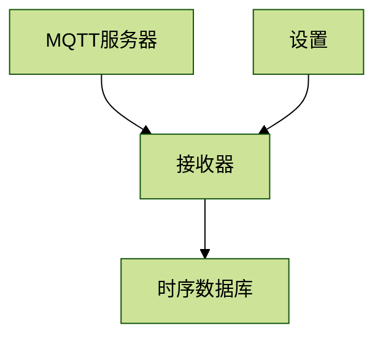

# MQTT

## 台账(FB)

## 预警设置(FB)

## 告警(FB)

## 设备管理(FB) 

## Receiver(FB)

```mermaid
graph TD
%%{init: {'theme':'forest'}}%%
    Server[MQTT服务器] --> Client[接收器]
    Option[设置] --> Client
    Client --> DB[时序数据库]
```